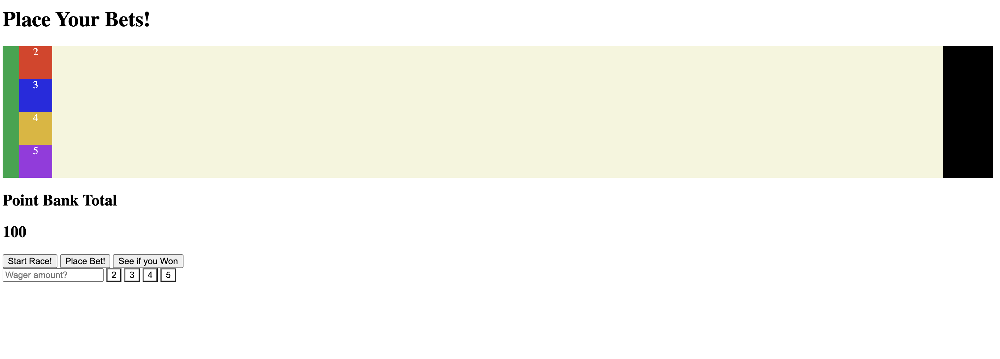

# Place-Your-Bets

# Game Inspiration
A browser game deisgned to simulate the horse racing gambling industry
As a child my father taught the joys and heartaches of betting the horses, I thought it would be fun to design a simple game based upon that idea. Where the gambler (or user in this case) can experience all the emotions that are associated with it. 
  emotions like the following:
 - The hope of picking the right racer and winning your bet!
 - The anticipation for the race to start!
 - The excitement while the race is being run!
 - the fear that you might lose your bet! 
 - the joy of winning you bet and gaining more! 
 - the determination of picking the next winner after losing! 
 - and more!!!

Rules of Place Your Bets!
1. Object of the game is to guess the correct winner of the race
2. In order to proceed the player will do the following in order
    - decide how many points they would like to wager.
    - type in desired bet value into the input box
    - select a racer by its number (note: the odds of the racer winning is a direct     correlation to their number. ex: 2 = 2-1 odds)
    - Click the place bet button to register your bet with the computer
    - Click the Start Race button and cheer for their racer. 
    - Once race is completed, click on the Check Payout button to learn how much the player has won, or if they lost their money
    - then rinse and repeat the above steps.
3. If the playerr's choice matches then winner of the race, then the bet is paid out accordering to odds 
4. If the player does not choose the winner of the race, then the bet is lost and the user the player also loses the bet if there is a tie!
5. The game is over if the player is forced to wager their last point

# Languages
- HTML5
- CSS
- JavaScript 

# Research References I used for building game
https://www.youtube.com/watch?v=eI9idPTT0c4
https://developer.mozilla.org/en-US/docs/Web/API/Canvas_API/Tutorial/Drawing_shapes
https://www.youtube.com/watch?v=YszONjKpgg4
https://www.w3schools.com/jsref/prop_style_transform.asp
https://www.w3schools.com/jsref/prop_style_transitionduration.asp
https://stackoverflow.com/questions/6028128/how-do-i-rotate-text-in-css